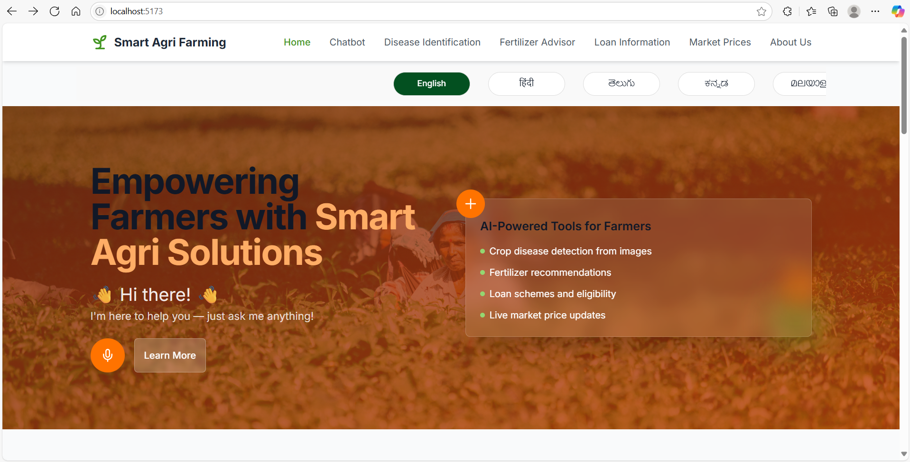
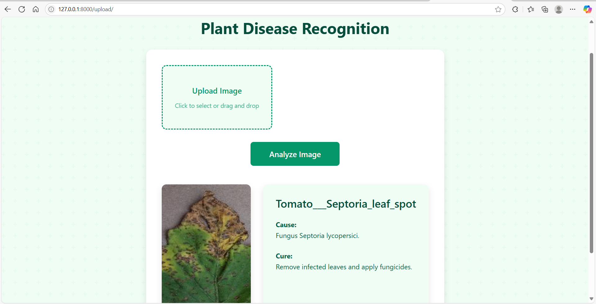
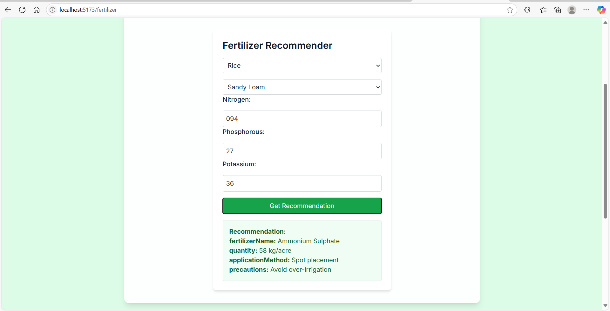
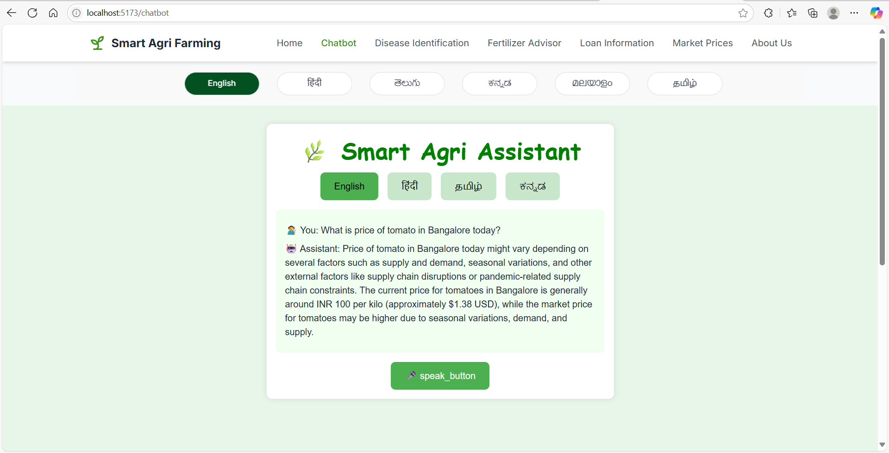

# Smart Agriculture System 🌱

A comprehensive smart agriculture solution that combines plant disease detection, fertilizer recommendations, and an AI-powered chatbot to assist farmers.

### Deployment URLs
- Frontend: https://smart-agri-farming-rbrw.vercel.app/

## 📸 Screenshots

### Main Dashboard

*Main dashboard showing all available features*

### Plant Disease Detection

*Upload and analyze plant images for disease detection*

### Fertilizer Recommendation

*Get personalized fertilizer recommendations*

### AI Chatbot

*Interactive AI-powered farming assistant*

## 🌟 Features

- **Plant Disease Detection**: Identify plant diseases using advanced image recognition
- **Fertilizer Recommendation**: Get personalized fertilizer suggestions based on crop type, soil type, and NPK values
- **AI Chatbot Assistant**: Interactive chatbot powered by TinyLlama to answer farming-related queries
- **Modern UI**: Responsive and user-friendly interface built with React and Tailwind CSS

## 🛠️ Tech Stack

### Frontend
- React
- TypeScript
- Vite
- Tailwind CSS
- Axios for API calls

### Backend Services
- **Main Backend**: Node.js with Express
- **Chatbot Backend**: Node.js with TinyLlama integration
- **Plant Disease Recognition**: Python with ML models

## 🚀 Getting Started

### Prerequisites
- Node.js (v14 or higher)
- Python 3.9
- Ollama (for TinyLlama)
- Git

### Installation

1. **Clone the repository**
   ```bash
   git clone https://github.com/yourusername/smart-agriculture.git
   cd smart-agriculture
   ```

2. **Frontend Setup**
   ```bash
   cd frontend
   npm install
   npm run dev
   ```

3. **Backend Setup**
   ```bash
   cd backend
   npm install
   npm start
   ```

4. **Chatbot Backend Setup**
   ```bash
   cd chatbot-backend/smart-agri-backend
   npm install
   npm start
   ```

5. **Plant Disease Recognition Setup**
   ```bash
   cd Plant-Disease-Recognition-System
   pip install -r requirements.txt
   python app.py
   ```

6. **TinyLlama Setup and Run**
   ```bash
   # Install Ollama (if not already installed)
   # For Windows:
   winget install ollama
   # For MacOS:
   curl https://ollama.ai/install.sh | sh
   # For Linux:
   curl https://ollama.ai/install.sh | sh

   # Start Ollama service
   ollama serve

   # In a new terminal, pull and run TinyLlama
   ollama pull tinyllama
   ollama run tinyllama
   ```

### Environment Variables

Create `.env` files in respective directories:

**Frontend (.env)**
```
VITE_API_URL=http://localhost:5000
VITE_CHATBOT_URL=http://localhost:5001
VITE_PLANT_DISEASE_URL=http://localhost:5002
```

**Backend (.env)**
```
PORT=5000
FRONTEND_URL=http://localhost:5173
```

**Chatbot Backend (.env)**
```
PORT=5001
FRONTEND_URL=http://localhost:5173
```

**Plant Disease Recognition (.env)**
```
PORT=5002
MODEL_PATH=models/plant_disease_recog_model_pwp.keras
```

## 📱 Usage

1. **Plant Disease Detection**
   - Navigate to the Plant Disease page
   - Upload an image of the plant
   - Get instant disease detection results

2. **Fertilizer Recommendation**
   - Select crop type
   - Enter soil type
   - Input NPK values
   - Get personalized fertilizer recommendations

3. **AI Chatbot**
   - Click on the chat icon
   - Ask any farming-related questions
   - Get instant AI-powered responses

## 🌐 Deployment

The project is deployed on:
- Frontend: Vercel
- Backend Services: Render


## 📝 License

This project is licensed under the MIT License - see the [LICENSE](LICENSE) file for details.


## 👥 Authors

- Pavithra Revankar - Initial work


## 🙏 Acknowledgments

- TinyLlama for the chatbot capabilities
- Plant disease detection model contributors
- All open-source libraries used in this project


## 📚 API Documentation

### Backend API Endpoints

#### Fertilizer Recommendation
```http
POST /api/recommend-fertilizer
Content-Type: application/json

{
  "cropType": "string",
  "soilType": "string",
  "nitrogen": number,
  "phosphorus": number,
  "potassium": number
}
```

Response:
```json
{
  "fertilizer": "string"
}
```

#### Plant Disease Detection
```http
POST /api/detect-disease
Content-Type: multipart/form-data

file: image
```

Response:
```json
{
  "disease": "string",
  "confidence": number,
  "recommendations": ["string"]
}
```

#### Chatbot
```http
POST /api/chat
Content-Type: application/json

{
  "message": "string"
}
```

Response:
```json
{
  "response": "string"
}
